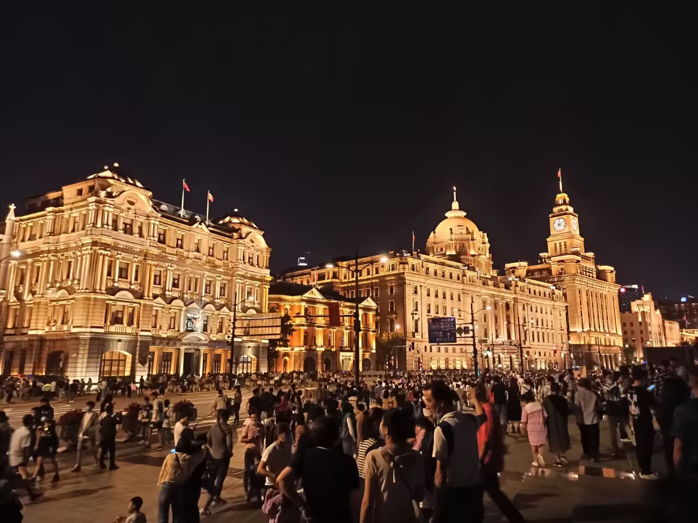

> 致我人生中最荒唐的四年。

## 经历

差不多从现在开始，我就毕业了。是的，我荒唐的四年大学生活，结束了。我不再是那个喜欢看书的自己，我现在什么也不知道。

在为了秋招和春招奋斗了近两年之后，我最后才幡然醒悟：也许我需要一次考研。是的，我将我找工作失败的一部分原因归结于我的学历不足，但另一个重要原因是：最后的结局与考研失败一样。

我的能力如何？我只能说，我还远远不够。我的人生是从大学开始的，在此之前的所有东西，包括高三，这些记忆都如同断片一样忘记了。然后我上了大学做了什么？选择参加 ACM 竞赛，然后像那些没有任何工程经验的人一样，从退役之后立刻投入工程实践，期待自己找到一份理想的实习。

然而现实总是冷酷无情的，我在暑假实习的末尾，才找到一份游戏客户端实习，到最后却没有转正。其中的原因很多，可能是我无法接受继续实习到秋招结束后再观察转正，也可能是在此之后公司的一个大分部直接就地解散，新人不再涨薪，也可能是去实习之后发现理想和现实存在差距，梦想破裂时候的气头。

然而不管如何，现在的我处于我的失业状态。

而我为了就业，做了什么？学了 c#、rust、f# ？不得不承认他们对于我的认知帮助很有用，非常有用，我了解很多关于习惯上的事情，但是还不够，我对于写一个实际的东西时总是心存畏惧，而这是最为致命的。

## 想法

即使我对之前的事情记忆不多，但我依然能清楚发生的大概事件，因为造成记忆不多的罪魁祸首就是我那完全不关心别人的思想，或者说：我只求我想要上一所好学校。

过去的我，完全被锁在家里，完全被否定想做的事情，即使从小开始被老师邀请去参加竞赛，到最后实际上因为没有得到支持而结束了。然后校园欺凌来了，直到我出了一场车祸，流着血到学校晚自习，从此结束了那段阴暗的日子，但是内心的抑郁，依然伴随着，久久不能被驱散。在此之间，我其实也做过跳楼的自杀行为。

事情的转机是我看到一张图片。

我从没去过，厌世的我突然萌生了一个想法：我想去。

我只有这个愿望，对于什么也没有的我，这张图片无疑是最具有吸引力的。那么我做了什么：我把自己当作一台机器，不与别人接触，自己到一个孤独的位置，只有学习，和写日记，没有喜悦，只有悲伤，然后写在日记中，继续学习。

然后，我就这么上了大学，一所最糟糕的大学。我扮演一个继续内卷的学生，参加竞赛，学习编程知识，想要找工作。

那么我最后得到了什么？失败的大学生活，没有工作。然后我突然醒悟：这四年我在做什么呢？我的人生在做什么呢？

- “我希望你能平平安安活着”
- “你看看你现在的样子，过了失败的大学生活，目标是找工作连四级都不考，结果呢？”

我的人生在做什么呢？大三才会坐地铁，从来没去过漫展，从来没去旅游过，几乎不主动跟别人一起玩游戏，你还在活着吗？

我突然醒悟到，我似乎，从来没有，回答过我自己到底想做什么。那么现在是时候开始思考自己到底想做什么了，如果已经一无所有、无家可归的话。

## 现状

我的现状，则是一个词：迷茫。

我的工作流被否定之后，我似乎不再能拿出我所满意的作品。我所获得的信息，都是被刻意安排的，或者看到我所不愿看到的消息。我的消息获取太多，无关信息获取太多，有用信息获取太少。

我很不想看到一些关于 zz 的东西，因为我完全不想关心，一是我做不到，二是和我关系也不大。我不想看到 fake 内容，那种手头拿了 11 个 offer 的人，在群里一直喊着自己没有找到 offer ，而我问协程那些东西怎么搞，说了个 go 随便写写就好（问 c++ 呢……）。

同时又因为这所令人厌恶的大学，我的性格不但没有变好，反而多了一层：急功近利，焦虑，暴躁，害怕，浮躁。源于学校管理层的烂，源于学校管理层的不守信用，源于我对学校课程安排的失望，源于我自己对自己的失望。这样的一个人，可以做到什么呢？

但是我什么都做不到。我改变不了这所大学，我改变不了我的现状，我改变不了我的性格，我改名也不可以。

同时我还有伪善。是的，伪善。我会无缘无故帮助别人，但这完全是伪善，不是出于目的，也并非出于愧疚，这反而是一种伪善，直到第二次，第三次，逐渐发现，你的善行，对于别人来说则是理所当然的事情了。这不是伪善，是什么？

在写这篇日志时，我给了一个人 10 块钱，因为他请求我的帮助，筹集资金治疗他的孩子。但我已经是在同一地点、第二次给了他。他没有任何感谢的行为，仅仅是我支付后立刻寻找下一个目标。当然我并非说需要回报，而是希望能给个回应……

学习上被学校引导至荒废，工作没有，这就是结局吗？

## 未来

现在的我正在计划，做一个困难的目标，能让我再来一次，并且与之前不同的是，我已经被欺骗、被知道，那些我需要的知识了。

未来如何？我不知道。我只知道一件事情是：在我人生最有活力的时间，我是否能够做到我的目标？

> Will you bite the hand that feeds you. \
> Will you stay down on your knees.

以上。
